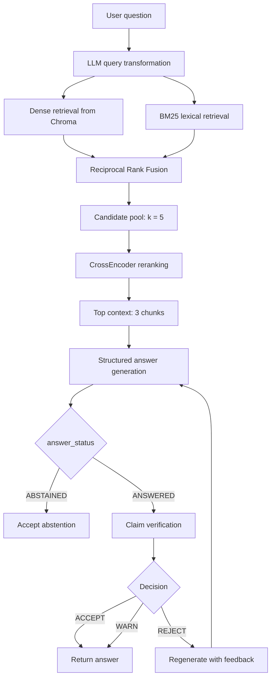

# Research Agent

Research Agent is an experimental retrieval-augmented generation (RAG) service
for answering questions from a local document collection. It combines dense
vector search, lexical search, reciprocal-rank fusion, neural reranking,
structured answer generation, and claim-level verification.

The project currently uses the Nexora company-policy document as its primary
BM25 source and includes additional Markdown/PDF ingestion utilities for
experiments. It can be used through an interactive command-line client or as a
FastAPI HTTP service.

## Capabilities

The current implementation provides:

- Markdown and PDF document loading.
- Recursive document chunking with 1,500-character chunks and 250-character
  overlap.
- Stable chunk metadata:
  - `document_id`
  - `chunk_id`
  - `source`
  - `file_type`
- Persistent Chroma vector storage.
- OpenAI embeddings through `text-embedding-3-small` by default.
- Dense similarity retrieval.
- BM25 lexical retrieval.
- Reciprocal Rank Fusion (RRF) of dense and lexical rankings.
- CrossEncoder reranking with `BAAI/bge-reranker-base`.
- LLM-based query transformation before retrieval.
- Structured answer generation with `ANSWERED` and `ABSTAINED` states.
- Chunk citations in generated answers.
- Claim-level verification with `SUPPORTED`,
  `PARTIALLY_SUPPORTED`, and `UNSUPPORTED` verdicts.
- Automatic regeneration of rejected answers, up to the configured attempt
  limit.
- Explicit acceptance of intentional abstentions without verification.
- Retrieval, generation, verification, and regeneration timing/trace spans.
- Token-usage metadata when the provider response exposes it.
- FastAPI health, readiness, and question-answering endpoints.
- Request IDs returned through the `X-Request-ID` response header.
- OpenAI-specific error mapping for timeout, rate-limit, connection, and
  general provider failures.
- Optional LangSmith tracing through the LangChain configuration.

## End-to-end flow



### Retrieval configuration

The main pipeline currently uses:

```python
RETRIEVAL_K = 5
CONTEXT_TOP_N = 3
```

`RETRIEVAL_K` controls the number of candidates returned by the hybrid
retriever. `CONTEXT_TOP_N` controls how many reranked chunks are placed in the
LLM context. This keeps the candidate pool broad enough for reranking while
limiting the generation context.

RRF uses `k=60`. BM25 currently rebuilds its retriever from
`data/documents/nexora_company_overview.md` during each question. The Chroma
database is loaded from the configured vector-store path.

### Answer reliability

`app/generation.py` asks the model to return a validated object containing:

```python
{
    "answer_status": "ANSWERED" | "ABSTAINED",
    "answer": "..."
}
```

The generator must use only the supplied context and cite important factual
claims using the format `[chunk: CHUNK_ID]`. If the context is insufficient, it
must abstain instead of inventing an answer.

For an `ANSWERED` response, `app/verification.py` checks every important claim.
The pipeline makes the following decisions:

- `ACCEPT`: all claims are supported.
- `WARN`: at least one claim is partially supported and none is unsupported.
- `REJECT`: at least one claim is unsupported.

Rejected answers are regenerated with verifier feedback until they are accepted
or the maximum attempt count is reached. An intentional `ABSTAINED` response is
accepted immediately.

## HTTP API

Start the service with:

```powershell
python -m uvicorn main:app --reload
```

The API is also available through the FastAPI application object in
`main.py`.

### `GET /`

Basic service information:

```json
{
  "message": "Research Agent API is running"
}
```

### `GET /health/live`

Liveness check. This confirms that the application process is responding:

```json
{
  "status": "alive"
}
```

### `GET /health/ready`

Readiness check. It verifies that the configured vector-store directory exists.
It returns HTTP 200 when ready and HTTP 503 when the vector store is not
available:

```json
{
  "status": "ready"
}
```

### `POST /ask`

Request:

```json
{
  "question": "What is Nexora's monthly meal allowance?"
}
```

The `question` field must contain at least one character. Empty questions are
rejected with HTTP 422.

Successful responses contain:

```json
{
  "answer": "...",
  "answer_status": "ANSWERED",
  "decision": "ACCEPT"
}
```

The response also includes an `X-Request-ID` header. The request ID is added to
request logs and passed as metadata to the LangSmith tracing context.

### Error responses

OpenAI provider errors are converted to stable HTTP responses:

| Error | HTTP status | API detail |
|---|---:|---|
| API timeout | 504 | The AI service timed out. Please try again. |
| Rate limit | 503 | The AI service is temporarily busy. Please try again. |
| Connection failure | 503 | The AI service is temporarily unavailable. |
| Other OpenAI error | 502 | The AI service could not complete the request. |
| Unexpected application error | 500 | An unexpected error occurred while processing your request. |

## Project structure

```text
app/
  api.py              FastAPI app, routes, middleware, and error handlers
  config.py           Pydantic settings loaded from environment and .env
  generation.py       Structured answer generation and usage extraction
  hybrid_retrieval.py BM25 retrieval and RRF fusion
  ingestion.py        Markdown/PDF loading and document chunking
  llm.py              OpenAI chat and embedding factories
  pipeline.py         Complete retrieval, generation, verification workflow
  query_transform.py  LLM query rewriting for retrieval
  reranker.py         Cached CrossEncoder and reranking
  retrieval.py        Chroma similarity-search helpers
  tracing.py          Lightweight local span tracing
  vector_store.py     Chroma persistence and embedding configuration
  verification.py     Claim schema, verification, and decision calculation
  verifier.py         Additional verifier experiment code

data/
  chroma/             Persisted Chroma database
  documents/          Markdown and PDF source documents

scripts/
  index_documents.py                  Build/update the Chroma index
  query.py                            Interactive query client
  create_eval_dataset.py              Create evaluation data
  evaluate_rag.py                     Evaluate the end-to-end RAG pipeline
  evaluate_retrieval.py               Evaluate retrieval quality
  evaluate_reranker.py                Evaluate reranking quality
  run_evaluation.py                   Run evaluation queries
  inspect_metadata.py                 Inspect indexed metadata
  test_*.py                           Focused retrieval/model experiments

tests/
  test_api.py          API behavior tests
  test_config.py       Settings validation tests
  retrieval_eval.py    Retrieval evaluation utilities

main.py                Application entry point (`from app.api import app`)
requirements.txt       Python dependencies
```

## Requirements

- Python 3.10 or newer is recommended.
- An OpenAI API key is required for embeddings, query transformation,
  generation, and verification.
- The CrossEncoder downloads its Hugging Face model on first use.
- A writable local directory is required for Chroma persistence.
- Network access is required the first time external models or APIs are used.

## Installation

From the repository root, create and activate a virtual environment:

```powershell
python -m venv .venv
.\.venv\Scripts\Activate.ps1
python -m pip install --upgrade pip
python -m pip install -r requirements.txt
```

Create a local `.env` file. Do not commit real credentials:

```text
OPENAI_API_KEY=your-openai-api-key
```

Optional LangSmith tracing variables:

```text
LANGCHAIN_API_KEY=your-langsmith-api-key
LANGCHAIN_TRACING_V2=true
LANGCHAIN_PROJECT=research-agent
```

The settings model reads `.env` from the working directory and supports these
application variables:

| Variable | Default | Purpose |
|---|---|---|
| `OPENAI_MODEL` | `gpt-4o` | Chat model used for transformation, generation, verification, and regeneration |
| `OPENAI_TIMEOUT` | `10` | Provider request timeout in seconds; must be positive |
| `OPENAI_MAX_RETRIES` | `2` | Provider retry count; cannot be negative |
| `EMBEDDING_MODEL` | `text-embedding-3-small` | OpenAI embedding model |
| `VECTOR_DB_PATH` | `./data/chroma` | Chroma persistence directory |

## Build the vector index

Run the indexing script after adding or changing source documents:

```powershell
python -m scripts.index_documents
```

The script currently indexes
`data/documents/nexora_company_overview.md`. It:

1. Loads the Markdown document.
2. Splits it into overlapping chunks.
3. Adds document and chunk metadata.
4. Generates embeddings.
5. Persists the chunks in the configured Chroma directory.

The query pipeline's BM25 source is currently fixed to the same Nexora Markdown
file. Adding a document to the Chroma store alone does not automatically add it
to BM25 retrieval.

## Run the interactive client

```powershell
python -m scripts.query
```

The client accepts multiple questions in one process. Enter `exit` or `quit` to
stop. Example questions:

```text
What is Nexora's monthly meal allowance?
Does Nexora provide free lunch at its offices?
```

The query workflow prints the transformed query, retrieved/reranked context,
retrieval timings, generated answer, verification claims, decision, and local
trace spans.

## Run the API

```powershell
python -m uvicorn main:app --reload
```

Useful local URLs:

- `http://127.0.0.1:8000/`
- `http://127.0.0.1:8000/health/live`
- `http://127.0.0.1:8000/health/ready`
- `http://127.0.0.1:8000/docs`

Example PowerShell request:

```powershell
Invoke-RestMethod `
  -Method Post `
  -Uri http://127.0.0.1:8000/ask `
  -ContentType "application/json" `
  -Body '{"question":"What is Nexora''s monthly meal allowance?"}'
```

## Testing and evaluation

Run the automated tests:

```powershell
python -m pytest tests
```

The API tests cover OpenAI timeout handling and validation of empty questions.
The configuration tests cover positive timeout validation and non-negative
retry-count validation.

Focused experiment and evaluation commands include:

```powershell
python -m scripts.test_hybrid
python -m scripts.test_bm25
python -m scripts.test_rrf
python -m scripts.test_reranker
python -m scripts.test_reranker_chroma
python -m scripts.test_query_transformation
python -m scripts.test_query_transformation_retrieval
python -m scripts.test_structured_output
python -m scripts.test_metadata_filter
python -m scripts.test_parent_child
python -m scripts.evaluate_retrieval
python -m scripts.evaluate_reranker
python -m scripts.evaluate_rag
python -m scripts.run_evaluation
```

Some scripts require an existing Chroma index, an OpenAI key, network access,
or a downloaded CrossEncoder model. They are experiments and are not all
isolated unit tests.

For a syntax-only check:

```powershell
python -m py_compile app/*.py scripts/*.py
```

## Observability

### Request logging

The FastAPI middleware generates a UUID request ID for every request, stores it
on `request.state`, adds it to request logs, and returns it as `X-Request-ID`.
Failures are logged with their traceback before being handled by the API
exception handlers.

### Local pipeline spans

`app/tracing.py` records spans for:

- Retrieval
- Generation
- Verification
- Regeneration

The retrieval span records the candidate count and timing breakdown. Generation
and verification spans record attempt numbers, claim counts, verdict counts, and
available token-usage metadata.

### LangSmith

The query transformation, generation, verification, regeneration, and complete
RAG pipeline use LangChain traceable wrappers where configured. The API also
places the request ID in the LangSmith tracing metadata context.

## Current limitations

The project is still an evolving research prototype. The following behaviors
are intentionally not presented as production-ready:

1. BM25 is rebuilt on every question from one hard-coded Markdown source.
2. The Chroma index has no formal version, migration, reset, or deletion
   workflow.
3. Indexing currently targets the Nexora Markdown file rather than discovering
   all files in `data/documents`.
4. The CrossEncoder is cached only in the current process; cold-start model
   loading is still visible on the first query.
5. The API performs the complete RAG workflow synchronously inside the request.
6. The evaluation scripts are useful experiments, but the project does not yet
   have a complete mocked end-to-end regression suite.
7. Provider responses, malformed structured output, missing indexes, and model
   loading failures need broader production-grade recovery and monitoring.
8. Configuration covers core provider and storage settings, while retrieval
   limits and model choices in parts of the pipeline remain code-level
   constants.
9. `WARN` is produced by the verification decision logic, but the public API
   response model currently documents only `ACCEPT` and `REJECT`; this should be
   aligned before relying on partially supported answers through the API.

## Development direction

The next architectural improvements should focus on:

1. Building dense and BM25 indexes once during ingestion.
2. Persisting an index manifest with source files, chunking settings, embedding
   model, and index version.
3. Loading retrievers and models during application startup instead of rebuilding
   them per request.
4. Adding mocked provider tests for `ANSWERED`, `ABSTAINED`, `WARN`, `REJECT`,
   regeneration, and provider failures.
5. Moving retrieval limits, reranker settings, and feature flags into validated
   application configuration.
6. Adding explicit index reset, update, and document-removal commands.
7. Aligning the API response contract with every decision that the pipeline can
   produce.
